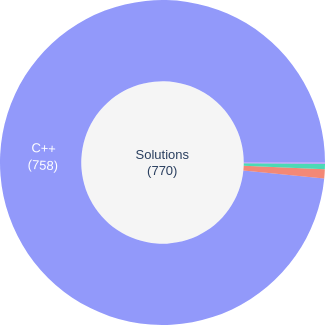

# Online Judge Problem Solutions

My solutions for competitive programming problems on several platforms.

## Table of contents

- [Summary](#summary)
- [Graphs](#graphs)
- [Must-Read](#must-read)
  - [As Is Condition](#as-is-condition)
  - [Code of Conduct](#code-of-conduct)

## Summary

This repository contains 770 solutions to 638 problems in several platforms and most of the
solutions were developed in *C++*.

| Online Judge | Problems Solved | Solutions  | Notes                                    |
| ------------ | :-------------: | :-------:  | -----                                    |
| Aizu         | 16*             | 19*        |                                          |
| AtCoder      | 12*             | 12*        |                                          |
| CodeChef     | 1*              | 3*         |                                          |
| Codeforces   | 356 (406*)      | 431 (488*) | 1 solution in C, 3 in C# and 1 in Python |
| CSAcademy    | 21              | 24         |                                          |
| HackerRank   | 1*              | 1*         |                                          |
| Kattis       | 6               | 9          |                                          |
| LightOJ      | 22*             | 22*        |                                          |
| MOG          | 94              | 121        | 3 solutions in C and 4 in C#             |
| POJ          | 1*              | 1*         |                                          |
| SPOJ         | 5 (21*)         | 10 (31*)   |                                          |
| TopCoder     | 10*             | 10*        |                                          |
| URAL         | 3*              | 4*         |                                          |
| UVA          | 24*             | 25*        |                                          |
| VJudge       | 156             | 175        |                                          |

\* Counting VJudge solutions.

**Note:**  *Virtual Judge (VJudge)* is not a real online judge, it grabs problems from other
regular online judges and simulates the submissions.

## Graphs

In the following images and tables, you will be able to read some graphs regarding the problems
solved, the solutions and the programming languages used. Note that if a field does not contain
text, it's because it wouldn't fit in the space of the field.

## Must-Read

This is a private repository to maintain and share my solutions on several online judge
platforms. **DO NOT** send pull requests to this repository unless you are fixing some bugs or
submitting similar commits, e.g. we can make a shared repository with solutions belonging to
multiple users.

### As Is Condition

The code is provided **as is**. For further knowledge please read the [license](./license). Added
to the license terms, please read the following points as a summary:

1. This repository is entirely personal and I/we made it public in the hope that someone might find
it useful.
2. All solutions were accepted at the time they were submitted to their respective online judge.
The solutions were developed to fulfill the requirements of the problem, however, solutions may be
wrong, broken, buggy or not work at all if something regarding the problem and/or test cases has
changed.
3. Solutions might not be best in algorithmic complexity terms, but they meet the memory and time
complexity of the problems.
4. Solutions might be illegible. Some of them were developed in a contest and/or written in a rush
and hence, they probably contain bad practices or anti-patterns.
5. The use of the scripts to download solutions from Codeforces and MOG, as well as the stats
script, is completely under your responsibility and you should use them in a good way, e.g. avoid
doing unnecessary requests or too many requests in a short period of time.

### Code of Conduct

If you have something to share, please, don't hesitate and send your pull request!

Here are some basic rules to follow:

1. Keep the whole hierarchical structure clean and reasonable. E.g. avoid single directories with
too many files or paths too deep.
2. Name your solutions in a meaningful and consistent way. Follow the already-in-use naming
convention if it applies to your case, it does not matter if you will add solutions to an existing
online judge in this repo or a new one. In case this naming convention doesn't fit for the new
judge then, create one for the new judge and update this readme so others can follow your naming
convention, and update the stats script as well. A general rule of thumb about the current naming
convention is:  
    `<judge_name>/<contest_type>/<contest_name>/<solution_name>.<language_extension>`
3. Code in a neat way. There is no need to update your code style to be perfect or to follow a
coding style, but there is no need to have really ugly code as well. No one likes the no-space and
no-enter guy that writes all his codes in three lines and these lines contain 200+ characters. So,
some basic coding conventions should be followed.
4. Avoid duplicate solutions. Although more than one solution to a problem is allowed if they are
implemented in different languages or they have different approaches.
5. Spam or ads in code are not welcome.
6. At the beginning of the solutions, please add the problem name, problem link and submission
link, if public.
7. If you want to "sign" your code, you can do so through comments at the beginning of your
solutions, writing your name or any type of identification you want but please, be consistent!
8. In case you use any copyrighted code or third-party library please, document your code or any
file you need with it. But keep an eye on the public status of this repo and take into account that
**it will not change**, so you are not welcome to change the license of this project to make it
non-public.
